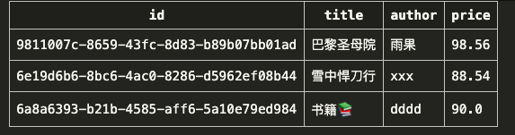

## 连接数据库

- 资源 CURD 操作
- 通过 prisma schema 和 sqlite 数据库管理数据

### 安装依赖并初始化 prisma

安装 prisma 依赖，prisma 初始化指定 sqlite 数据库：

```bash
yarn add prisma -D

npx prisma init --datasource-provider sqlite
```

### 新建一个 CURD 资源

通过 nestjs cli 提供的 resource 新建一个 books 的 CURD 资源

```bash
nx g @nrwl/nest:resource books
```

### 指定 books 表的数据结构

在 `src/books/dto/create-book.dto.ts` 文件指定 book ts 类型：

```ts
import { ApiProperty } from '@nestjs/swagger';

export class CreateBookDto {
  @ApiProperty({
    description: '书名',
  })
  title: string;
  @ApiProperty({
    description: '作者',
  })
  author: string;
  @ApiProperty({
    description: '价格',
  })
  price: number;
}

```

同时 `prisma/schema.prisma` 文件添加 book model：

```js
model book {
  id String @id @unique @default(uuid())
  title String @default("")
  author String @default("")
  price Float @default(0)

  @@map("books")
}
```

### 初始化数据表

```
npx prisma db push
```

命令生成 `prisma/dev.db` 文件作为数据库，同时数据库中生成了 books 表



### 连接数据表

#### 新建 prisma 服务

```bash
nest g -s prisma
```

#### 使用 prisma client 搭建 prisma 服务

```
yarn add @prisma/client
```

修改 `prisma.service.ts` 文件：

```ts
import { INestApplication, Injectable, OnModuleInit } from '@nestjs/common';
import { PrismaClient } from '@prisma/client';

@Injectable()
export class PrismaService extends PrismaClient implements OnModuleInit {
  async onModuleInit() {
    await this.$connect();
  }

  async enableShutdownHooks(app: INestApplication) {
    this.$on('beforeExit', async () => {
      await app.close();
    });
  }
}
```

注意，需要在 `app.module.ts` 中注册 prisma 服务。

#### 数据库 CURD 操作

改写 `books.service.ts` 支持 books 的增删改查，注意，需要在 `books.module.ts` 中注册 prisma 服务。

```ts
import { Injectable } from '@nestjs/common';
import { PrismaService } from 'src/prisma/prisma.service';
import { CreateBookDto } from './dto/create-book.dto';
import { UpdateBookDto } from './dto/update-book.dto';

@Injectable()
export class BooksService {
  constructor(private readonly prismaService: PrismaService) {}

  create(createBookDto: CreateBookDto) {
    return this.prismaService.book.create({
      data: createBookDto,
    });
  }

  findAll() {
    return this.prismaService.book.findMany({ where: {} });
  }

  findOne(id: string) {
    return this.prismaService.book.findUnique({
      where: {
        id,
      },
    });
  }

  update(id: string, updateBookDto: UpdateBookDto) {
    return this.prismaService.book.update({
      where: { id },
      data: updateBookDto,
    });
  }

  remove(id: string) {
    return this.prismaService.book.delete({
      where: { id },
    });
  }
}
```

然后就可以操作 swagger api 文档或者 postman 等工具操作 books 的 CURD 功能。


